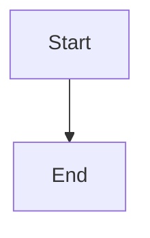

# eval-hub.github.io

Documentation site for EvalHub - community-contributed evaluation framework adapters.

## Overview

This repository contains the source for the [EvalHub documentation](https://eval-hub.github.io) built with MkDocs Material.

## Development

### Prerequisites

- Python 3.12+
- pip

### Setup

```bash
# Install dependencies
make install

# Or manually
pip install -r requirements.txt
```

### Local Development

```bash
# Start development server
make serve

# Documentation will be available at http://127.0.0.1:8000
```

The development server supports live reload - changes to documentation will automatically refresh the browser.

### Building

```bash
# Build static site
make build

# Output will be in site/
```

### Cleaning

```bash
# Remove built documentation
make clean
```

## Deployment

### Automatic Deployment

Documentation is automatically built and deployed to GitHub Pages when changes are pushed to the `main` branch.

### Manual Deployment

```bash
# Deploy to GitHub Pages
make deploy
```

This will:
1. Build the documentation
2. Push to the `gh-pages` branch
3. GitHub Pages will serve the updated site

## Documentation Structure

```
docs/
├── index.md                          # Home page
├── getting-started/
│   ├── overview.md                   # Overview
│   ├── installation.md               # Installation
│   └── quickstart.md                 # Quick start guide
├── adapters/
│   ├── lighteval/
│   │   ├── index.md                  # LightEval overview
│   │   ├── configuration.md          # Configuration reference
│   │   ├── benchmarks.md             # Benchmark list
│   │   └── examples.md               # Usage examples
│   └── guidellm/
│       ├── index.md                  # GuideLLM overview
│       ├── configuration.md          # Configuration reference
│       ├── profiles.md               # Execution profiles
│       ├── metrics.md                # Performance metrics
│       └── examples.md               # Usage examples
├── development/
│   ├── architecture.md               # Architecture details
│   └── creating-adapters.md          # Adapter creation guide
└── reference/
    └── api.md                        # API reference
```

## Contributing

### Adding Documentation

1. Create or edit Markdown files in `docs/`
2. Update `mkdocs.yml` navigation if adding new pages
3. Test locally with `make serve`
4. Submit a pull request

### Writing Style

- Use British English spelling
- Use clear, concise language
- Include code examples where appropriate
- Add admonitions for important notes
- Use tabs for alternative approaches

### Markdown Extensions

The site uses Material for MkDocs with the following extensions:

- **Code highlighting**: Syntax-highlighted code blocks
- **Admonitions**: Note, tip, warning, danger boxes
- **Tabs**: Tabbed content for alternatives
- **Mermaid**: Diagrams and flowcharts
- **Tables**: Table support
- **Task lists**: Checkboxes in lists

Example:

````markdown
!!! note "Important Information"
    This is an important note.

=== "Option 1"
    ```bash
    command-1
    ```

=== "Option 2"
    ```bash
    command-2
    ```


````

## License

See the [LICENSE](LICENSE) file for details.

## Links

- [Live Documentation](https://eval-hub.github.io)
- [EvalHub Contrib](https://github.com/eval-hub/eval-hub-contrib)
- [EvalHub Server](https://github.com/eval-hub/eval-hub)
- [EvalHub SDK](https://github.com/eval-hub/eval-hub-sdk)
