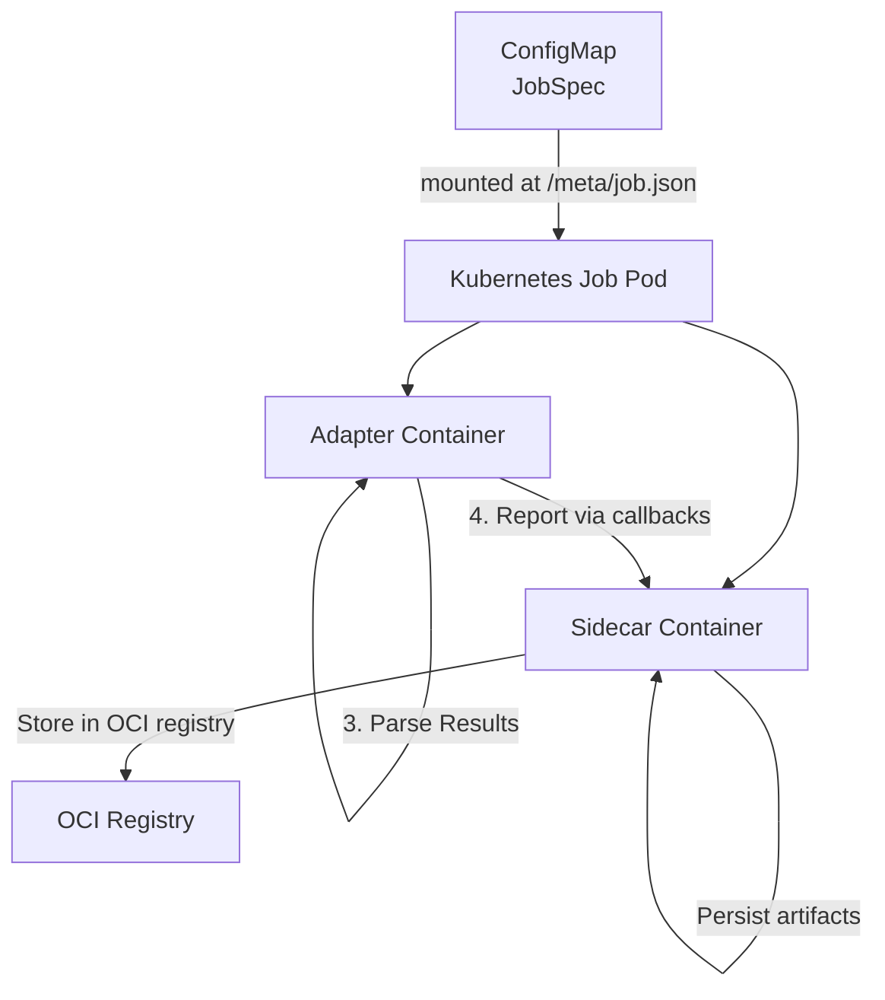

# GuideLLM Adapter

The GuideLLM adapter integrates [GuideLLM](https://github.com/vllm-project/guidellm) with the eval-hub evaluation service using the evalhub-sdk framework adapter pattern.

## Overview

GuideLLM is a performance benchmarking platform designed to evaluate language model inference servers under realistic production conditions.

### Key Features

- **Multiple execution profiles**: Sweep, throughput, concurrent, constant, poisson, synchronous
- **Comprehensive metrics**: Time to First Token (TTFT), Inter-Token Latency (ITL), end-to-end latency, throughput
- **Flexible data sources**: Synthetic data generation, HuggingFace datasets, local files
- **Rich reporting**: JSON, CSV, HTML, and YAML output formats with detailed visualisations

### Supported Backends

- OpenAI-compatible endpoints (vLLM, Text Generation Inference, etc.)
- Any HTTP API following OpenAI's chat completions or completions format

## Architecture

The adapter follows the eval-hub framework adapter pattern with automatic configuration:



**Workflow:**

1. **Settings-based configuration**: Runtime settings loaded automatically from environment
2. **Automatic JobSpec loading**: Job configuration auto-loaded from mounted ConfigMap
3. **Callback-based communication**: Progress updates and artifacts sent to sidecar via callbacks
4. **Synchronous execution**: The entire job lifetime is defined by the `run_benchmark_job()` method
5. **OCI artifact persistence**: Results persisted as OCI artifacts via the sidecar
6. **Structured results**: Returns `JobResults` with standardised performance metrics

## Quick Start

### Building the Container

```bash
make image-guidellm
```

### Running Locally

For local testing without Kubernetes:

=== "Basic Usage"

    ```bash
    # Set environment for local mode
    export EVALHUB_MODE=local
    export EVALHUB_JOB_SPEC_PATH=meta/job.json
    export SERVICE_URL=http://localhost:8080  # Optional: if mock service is running

    # Run the adapter
    python main.py
    ```

=== "With Ollama"

    ```bash
    # Start Ollama and pull a model
    ollama run qwen2.5:1.5b

    # Run benchmark against Ollama
    export EVALHUB_MODE=local
    export EVALHUB_JOB_SPEC_PATH=meta/job.json
    python main.py
    ```

## Container Image

```bash
# Pull from registry
podman pull quay.io/eval-hub/community-guidellm:latest

# Run with custom job spec
podman run \
  -e EVALHUB_MODE=local \
  -e EVALHUB_JOB_SPEC_PATH=/meta/job.json \
  -v $(pwd)/job.json:/meta/job.json:ro \
  quay.io/eval-hub/community-guidellm:latest
```

## What's Next?

- [Configuration Options](configuration.md) - Detailed configuration reference
- [Execution Profiles](profiles.md) - Different load testing patterns
- [Metrics](metrics.md) - Understanding performance metrics
- [Examples](examples.md) - Complete configuration examples
