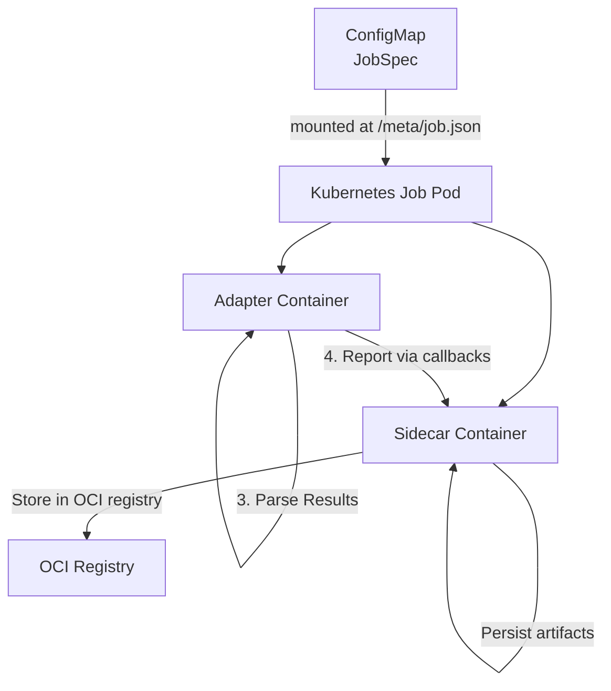

# LightEval Adapter

The LightEval adapter integrates [LightEval](https://github.com/huggingface/lighteval) with the eval-hub evaluation service using the evalhub-sdk framework adapter pattern.

## Overview

LightEval is a lightweight evaluation framework for language models that supports multiple model providers and a wide range of benchmarks.

### Key Features

- **Multiple model providers**: Transformers, vLLM, OpenAI, Anthropic, custom endpoints
- **Wide range of benchmarks**: HellaSwag, ARC, MMLU, TruthfulQA, GSM8K, and many more
- **Few-shot evaluation**: Configurable number of few-shot examples
- **Efficient evaluation**: Optimised for speed and resource usage

### Supported Providers

- **transformers**: HuggingFace Transformers models
- **vllm**: vLLM inference engine
- **openai**: OpenAI API
- **anthropic**: Anthropic API
- **endpoint**: Custom OpenAI-compatible endpoints
- **litellm**: LiteLLM proxy

## Architecture

The adapter follows the eval-hub framework adapter pattern:



## Quick Start

### Building the Container

```bash
make image-lighteval
```

### Running Locally

```bash
# Set environment for local mode
export EVALHUB_MODE=local
export EVALHUB_JOB_SPEC_PATH=meta/job.json
export SERVICE_URL=http://localhost:8080  # Optional

# Run the adapter
python main.py
```

## Supported Benchmarks

The adapter supports all LightEval tasks, organised by category:

### Commonsense Reasoning
- HellaSwag
- WinoGrande
- OpenBookQA

### Scientific Reasoning
- ARC Easy
- ARC Challenge

### Physical Commonsense
- PIQA

### Truthfulness
- TruthfulQA (multiple choice)
- TruthfulQA (generation)

### Mathematics
- GSM8K
- MATH (various subcategories)

### Knowledge
- MMLU
- TriviaQA

### Language Understanding
- GLUE benchmarks

## What's Next?

- [Configuration](configuration.md) - Detailed configuration reference
- [Benchmarks](benchmarks.md) - Complete benchmark list
- [Examples](examples.md) - Usage examples
