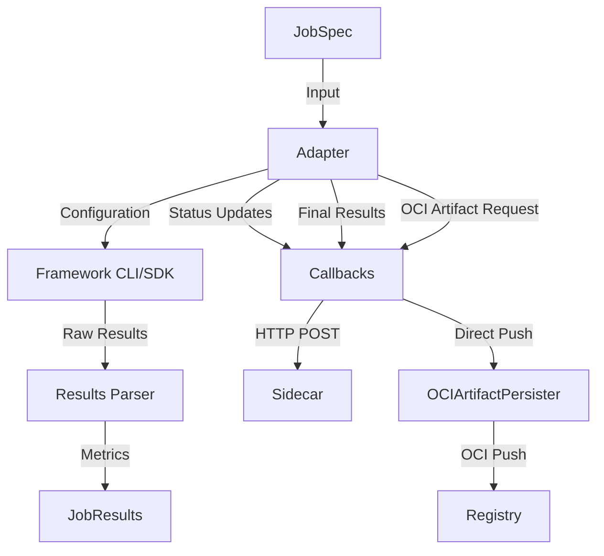
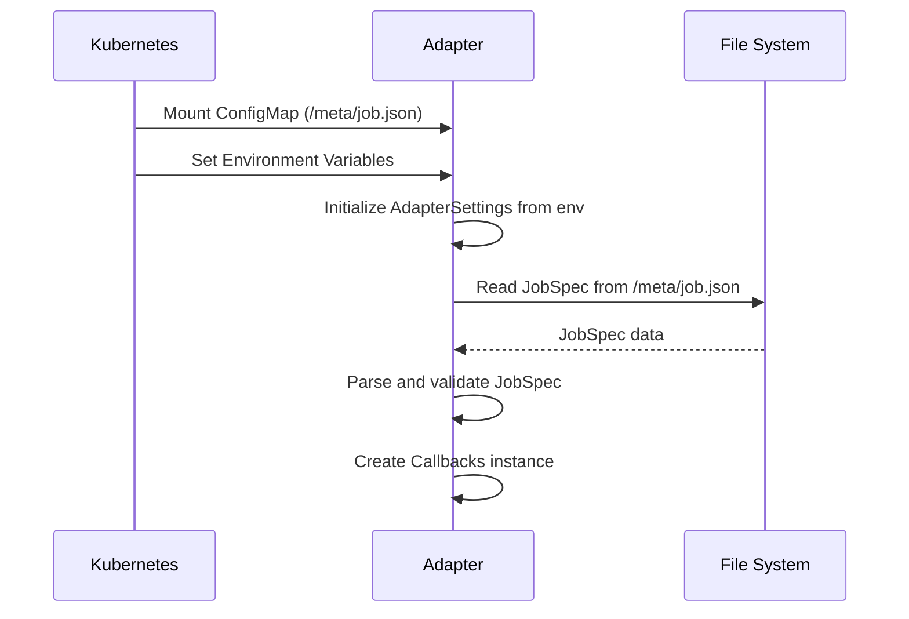
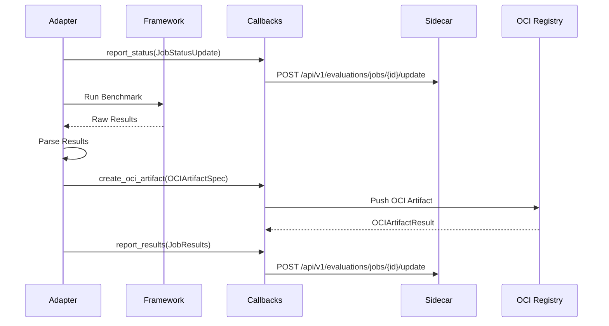
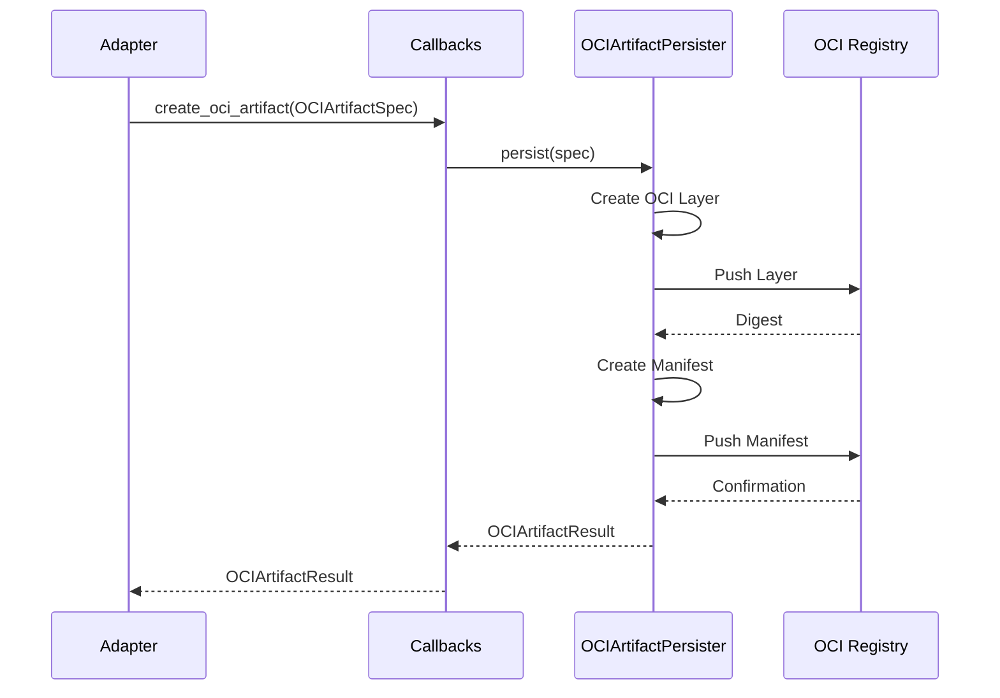

# Architecture

Technical architecture of EvalHub adapters.

## Adapter Pattern

All adapters implement the `FrameworkAdapter` interface from evalhub-sdk:

```python
from evalhub.adapter import FrameworkAdapter, JobSpec, JobResults, JobCallbacks
from evalhub.adapter.models import JobStatusUpdate, JobStatus, JobPhase, OCIArtifactSpec

class MyAdapter(FrameworkAdapter):
    """Custom evaluation framework adapter."""

    def run_benchmark_job(
        self,
        config: JobSpec,
        callbacks: JobCallbacks
    ) -> JobResults:
        """
        Run a benchmark job.

        Args:
            config: Job specification with configuration
            callbacks: Callbacks for progress and results reporting

        Returns:
            JobResults with metrics and metadata
        """
        # 1. Report initialization
        callbacks.report_status(JobStatusUpdate(
            status=JobStatus.RUNNING,
            phase=JobPhase.INITIALIZING,
            progress=0.1,
            message="Initializing evaluation"
        ))

        # 2. Run evaluation
        callbacks.report_status(JobStatusUpdate(
            status=JobStatus.RUNNING,
            phase=JobPhase.RUNNING_EVALUATION,
            progress=0.5,
            message="Running evaluation"
        ))
        raw_results = self._run_evaluation(config)

        # 3. Parse results
        evaluation_results = self._parse_results(raw_results)

        # 4. Persist artifacts to OCI registry
        oci_result = callbacks.create_oci_artifact(OCIArtifactSpec(
            files=self._get_output_files(),
            job_id=config.job_id,
            benchmark_id=config.benchmark_id,
            model_name=config.model.name
        ))

        # 5. Return results
        return JobResults(
            job_id=config.job_id,
            benchmark_id=config.benchmark_id,
            model_name=config.model.name,
            results=evaluation_results,
            overall_score=self._calculate_score(evaluation_results),
            num_examples_evaluated=len(evaluation_results),
            duration_seconds=self._get_duration(),
            oci_artifact=oci_result
        )
```

## Component Diagram



## Data Flow

### 1. Initialisation



### 2. Execution



### 3. Artifact Persistence



## Key Abstractions

### JobSpec

Job configuration loaded from ConfigMap:

```python
@dataclass
class JobSpec:
    job_id: str
    benchmark_id: str
    model: ModelConfig
    benchmark_config: Dict[str, Any]
    experiment_name: Optional[str] = None
    tags: Dict[str, str] = field(default_factory=dict)
    timeout_seconds: int = 60
```

### JobResults

Standardised results structure:

```python
@dataclass
class JobResults:
    job_id: str
    benchmark_id: str
    metrics: Dict[str, Any]
    overall_score: Optional[float] = None
    num_examples_evaluated: int = 0
    duration_seconds: float = 0.0
    metadata: Dict[str, Any] = field(default_factory=dict)
```

### JobCallbacks

Communication with sidecar and OCI registry:

```python
class JobCallbacks:
    def report_status(self, update: JobStatusUpdate) -> None:
        """Report job status update to the service.

        Sends status updates (including progress) to the sidecar which
        forwards to eval-hub service via POST /api/v1/evaluations/jobs/{id}/update
        """

    def create_oci_artifact(self, spec: OCIArtifactSpec) -> OCIArtifactResult:
        """Create and push OCI artifact directly to registry.

        The SDK persister handles OCI artifact creation and push.
        Returns artifact digest and reference information.
        """

    def report_results(self, results: JobResults) -> None:
        """Report final evaluation results to the service.

        Sends complete results to sidecar which forwards to eval-hub service
        via POST /api/v1/evaluations/jobs/{id}/update
        """
```

## Configuration Loading

### Environment Variables

```python
class AdapterSettings:
    mode: str = "k8s"  # or "local"
    job_spec_path: str = "/meta/job.json"
    service_url: Optional[str] = None
    registry_url: Optional[str] = None
    registry_username: Optional[str] = None
    registry_password: Optional[str] = None
    registry_insecure: bool = False
```

### JobSpec Loading

```python
# Automatic loading in k8s mode
if settings.mode == "k8s":
    with open("/meta/job.json") as f:
        job_spec = JobSpec(**json.load(f))

# Manual loading in local mode
elif settings.mode == "local":
    with open(settings.job_spec_path) as f:
        job_spec = JobSpec(**json.load(f))
```

## Error Handling

### Framework Errors

```python
try:
    results = self._run_evaluation(config)
except FrameworkError as e:
    callbacks.report_status(JobStatusUpdate(
        status=JobStatus.FAILED,
        error_message=str(e)
    ))
    raise
```

### Timeout Handling

```python
@timeout(job_spec.timeout_seconds)
def run_benchmark_job(self, job_spec, callbacks):
    # Evaluation logic
    pass
```

### Graceful Degradation

```python
# Continue on partial failures
try:
    artifact_files = self._collect_artifacts()
    callbacks.create_oci_artifact(OCIArtifactSpec(
        files=artifact_files,
        job_id=config.job_id,
        benchmark_id=config.benchmark_id,
        model_name=config.model.name
    ))
except ArtifactError:
    logger.warning("Failed to collect artifacts, continuing")
```

## Best Practices

### 1. Idempotent Operations

Ensure operations can be safely retried:

```python
def _run_evaluation(self, config):
    # Use random seed for reproducibility
    random.seed(config.random_seed)
    # Use unique output directories
    output_dir = f"/tmp/{job_id}"
```

### 2. Progress Reporting

Report progress at meaningful intervals:

```python
total = len(examples)
for i, example in enumerate(examples):
    if i % 10 == 0:
        progress = i / total
        callbacks.report_status(JobStatusUpdate(
            status=JobStatus.RUNNING,
            phase=JobPhase.RUNNING_EVALUATION,
            progress=progress,
            message=f"Processed {i}/{total}",
            completed_steps=i,
            total_steps=total
        ))
```

### 3. Structured Logging

Use structured logging for debugging:

```python
logger.info(
    "Running evaluation",
    extra={
        "job_id": job_spec.job_id,
        "benchmark_id": job_spec.benchmark_id,
        "num_examples": len(examples)
    }
)
```

### 4. Resource Cleanup

Clean up temporary resources:

```python
try:
    results = self._run_evaluation(config)
finally:
    self._cleanup_temp_files()
```

## Testing

### Unit Tests

Test individual components:

```python
def test_parse_results():
    adapter = MyAdapter(settings)
    raw_results = {"accuracy": 0.85}
    metrics = adapter._parse_results(raw_results)
    assert metrics["accuracy"] == 0.85
```

### Integration Tests

Test with mock service:

```python
@pytest.fixture
def mock_service():
    with MockEvalHubService() as service:
        yield service

def test_full_workflow(mock_service):
    adapter = MyAdapter(settings)
    results = adapter.run_benchmark_job(job_spec, callbacks)
    assert results.job_id == job_spec.job_id
```
