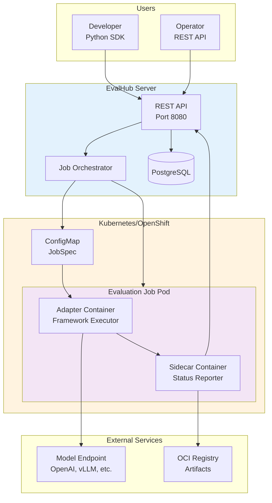

# Overview

EvalHub is an open source evaluation orchestration platform for Large Language Models, consisting of three integrated components.

## The EvalHub Ecosystem

### EvalHub Server

REST API orchestration service that manages evaluation workflows.

**Key responsibilities**:

- Expose versioned REST API (v1) for evaluation submission
- Orchestrate Kubernetes Job creation and lifecycle management
- Manage provider registry and benchmark discovery
- Store job metadata and results in PostgreSQL
- Export Prometheus metrics for observability

**Primary deployment targets**:

- Local development (http://localhost:8080)
- OpenShift clusters (production)
- Generic Kubernetes clusters

### EvalHub SDK

Python SDK providing three focused packages for different use cases.

**evalhub.client** - Submit evaluations to the service:
```python
from evalhub.client import EvalHubClient

client = EvalHubClient(base_url="http://localhost:8080")
job = client.submit_evaluation(model=..., benchmarks=[...])
```

**evalhub.adapter** - Build framework adapters:
```python
from evalhub.adapter import FrameworkAdapter, JobSpec, JobResults

class MyAdapter(FrameworkAdapter):
    def run_benchmark_job(self, job_spec, callbacks) -> JobResults:
        # Framework integration logic
        pass
```

**evalhub.models** - Shared data structures:
```python
from evalhub.models.api import ModelConfig, BenchmarkSpec
```

### EvalHub Contrib

Community-contributed framework adapters packaged as container images.

**Available adapters**:

- **LightEval**: Language model evaluation (HellaSwag, ARC, MMLU, TruthfulQA, GSM8K)
- **GuideLLM**: Performance benchmarking (TTFT, ITL, throughput, latency)

**Container images**:

- `quay.io/eval-hub/community-lighteval:latest`
- `quay.io/eval-hub/community-guidellm:latest`

## System Architecture



### Data Flow

1. **Client submits evaluation** via SDK or REST API
2. **Server creates Kubernetes Job** with adapter container and sidecar
3. **ConfigMap mounted** with JobSpec at `/meta/job.json`
4. **Adapter loads JobSpec**, runs evaluation, reports progress via callbacks
5. **Sidecar receives callbacks**, forwards to server, persists artifacts to OCI registry
6. **Server stores results** in PostgreSQL, returns status to client

## Core Concepts

### Providers

Evaluation providers represent evaluation frameworks or services.

**Example providers**:

- `lm_evaluation_harness` - EleutherAI's evaluation framework
- `ragas` - RAG evaluation framework
- `garak` - LLM vulnerability scanner
- `guidellm` - Performance benchmarking

Each provider exposes a set of benchmarks.

### Benchmarks

Benchmarks are specific evaluation tasks within a provider.

**Example benchmarks**:

- `mmlu` (lm_evaluation_harness) - Multitask accuracy
- `humaneval` (lm_evaluation_harness) - Code generation
- `performance_test` (guidellm) - Throughput and latency

### Collections

Collections are curated sets of benchmarks with weighted scoring.

**Example collection**:
```yaml
collection_id: healthcare_safety_v1
benchmarks:
  - benchmark_id: mmlu_medical
    provider_id: lm_evaluation_harness
    weight: 2.0
  - benchmark_id: truthfulqa
    provider_id: lm_evaluation_harness
    weight: 1.5
  - benchmark_id: toxicity
    provider_id: garak
    weight: 1.0
```

Collections enable domain-specific evaluation with a single API call.

### Jobs

Jobs are Kubernetes Job resources that execute evaluations in isolated environments. When an evaluation is submitted, the server creates a Job which progresses through a well-defined lifecycle: it begins in a Pending state while waiting for pod scheduling, transitions to Running when the adapter starts executing the evaluation, and completes with either a Completed status for successful evaluations or Failed when errors are encountered.

### Adapters

Adapters are containerised applications that bridge evaluation frameworks with EvalHub. Each adapter loads its JobSpec from a mounted ConfigMap, executes framework-specific evaluation logic, and reports progress through a standardised callback interface. Once evaluation completes, the adapter persists artifacts to an OCI registry and returns structured JobResults to the server, enabling consistent integration across diverse evaluation frameworks.

## Deployment Models

### Local Development

The local development model runs the server directly on your development machine at http://localhost:8080 without requiring Kubernetes infrastructure. Using SQLite for storage, this environment enables rapid iteration for server development, API testing, SDK development, and adapter prototyping.

### OpenShift Production

OpenShift deployments provide production-ready evaluation workflows through Kubernetes-native orchestration. The platform automatically manages job lifecycles, enforces resource isolation and limits, supports horizontal pod autoscaling, and integrates comprehensive monitoring and logging. This model is ideal for production model evaluation, CI/CD integration, multi-tenant evaluation scenarios, and large-scale benchmarking operations.

### Kubernetes (Generic)

Generic Kubernetes deployments use standard manifests compatible with any conformant cluster, enabling self-managed infrastructure with flexible configuration. This deployment model suits on-premises installations, custom Kubernetes distributions, and air-gapped environments where organisations manage their own infrastructure.

## Why EvalHub?

EvalHub provides a unified interface for evaluating models across heterogeneous frameworks using a consistent API, eliminating the need for framework-specific integration code. Its Kubernetes-native architecture leverages existing orchestration capabilities for job management, resource allocation, and scaling without requiring custom infrastructure. The adapter pattern enables extensibility, allowing new evaluation frameworks to integrate without modifying the core server. Production deployments benefit from structured logging, Prometheus metrics, and PostgreSQL persistence, providing the observability required for confident operation.

## Next Steps

- [Installation](installation.md) - Install server and SDK components
- [Quick Start](quickstart.md) - Run your first evaluation end-to-end
- [Server Documentation](../server/index.md) - Understand the Go server
- [SDK Documentation](../sdk/index.md) - Use the Python SDK
- [Contrib Documentation](../contrib/index.md) - Explore community adapters
