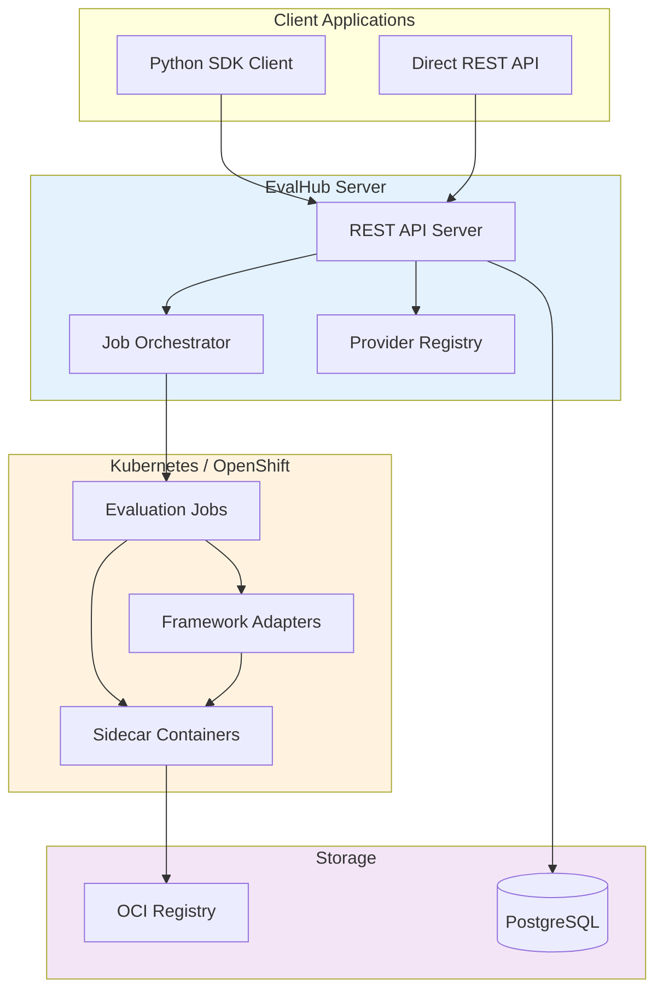

# EvalHub

Open source evaluation orchestration platform for Large Language Models.

## What is EvalHub?

EvalHub is an evaluation orchestration platform designed for systematic LLM evaluation. It supports both local development and Kubernetes-native deployment for scale. The platform consists of three components:

- **[EvalHub Server](https://github.com/eval-hub/eval-hub)**: REST API orchestration service for managing evaluation workflows
- **[EvalHub SDK](https://github.com/eval-hub/eval-hub-sdk)**: Python SDK for submitting evaluations and building adapters
- **[EvalHub Contrib](https://github.com/eval-hub/eval-hub-contrib)**: Community-contributed framework adapters

## Core Problem Solved

LLM evaluation involves coordinating multiple frameworks, managing evaluation jobs, tracking results, and handling diverse deployment environments. EvalHub solves this by providing:

- **Unified evaluation API**: Submit evaluations across frameworks using a consistent interface
- **Kubernetes-native orchestration**: Automatic job lifecycle management, scaling, and resource isolation
- **Framework adapter pattern**: "Bring Your Own Framework" (BYOF) approach with standardised integration
- **Multi-environment support**: Deploy locally for development or on OpenShift for production

## Architecture Overview



### Component Responsibilities

| Component | Description | Technology |
|-----------|-------------|------------|
| **Server** | REST API, job orchestration, provider management | Go, SQLite (local) / PostgreSQL (production) |
| **SDK** | Client library, adapter framework, data models | Python 3.12+ |
| **Contrib** | Community framework adapters (LightEval, GuideLLM) | Python containers |
| **Jobs** | Isolated evaluation execution environments | Kubernetes Jobs |
| **Registry** | Immutable artifact storage | OCI registries |

## Key Features

### Server Features

- **REST API**: Versioned API (v1) with OpenAPI specification
- **Provider management**: Discover evaluation providers and benchmarks
- **Collection management**: Curated benchmark collections with weighted scoring
- **Job orchestration**: Kubernetes Job lifecycle management
- **Persistent storage**: SQLite for local development, PostgreSQL for production
- **Prometheus metrics**: Production-ready observability

### SDK Features

**Client SDK** (`evalhub.client`):

- Submit evaluations to EvalHub service
- Discover providers, benchmarks, and collections
- Monitor job status and retrieve results
- Async/await support for non-blocking workflows

**Adapter SDK** (`evalhub.adapter`):

- Base class for framework integration
- Callback interface for status reporting
- OCI artifact persistence
- Settings-based configuration

**Core Models** (`evalhub.models`):

- Shared data structures
- Request/response schemas
- API model validation

### Contrib Features

- **LightEval**: Language model evaluation (HellaSwag, ARC, MMLU, TruthfulQA, GSM8K)
- **GuideLLM**: Performance benchmarking (TTFT, ITL, throughput, latency)
- **Containerised**: Production-ready container images

## Quick Start

### Submit an Evaluation (Python SDK)

```python
from evalhub.client import EvalHubClient
from evalhub.models.api import ModelConfig, BenchmarkSpec

# Connect to EvalHub service
client = EvalHubClient(base_url="http://localhost:8080")

# Submit evaluation
job = client.submit_evaluation(
    model=ModelConfig(
        url="https://api.openai.com/v1",
        name="gpt-4"
    ),
    benchmarks=[
        BenchmarkSpec(
            benchmark_id="mmlu",
            provider_id="lm_evaluation_harness"
        )
    ]
)

# Monitor progress
status = client.get_job_status(job.job_id)
print(f"Status: {status.status}, Progress: {status.progress}")
```

### Deploy on OpenShift

```bash
# Apply EvalHub manifests
oc apply -k config/openshift/

# Verify deployment
oc get pods -n eval-hub
oc logs -f deployment/eval-hub-server
```

### Build a Framework Adapter

```python
from evalhub.adapter import FrameworkAdapter, JobSpec, JobResults, JobCallbacks
from evalhub.adapter.models import JobStatusUpdate, JobStatus, JobPhase, OCIArtifactSpec

class MyAdapter(FrameworkAdapter):
    def run_benchmark_job(
        self,
        config: JobSpec,
        callbacks: JobCallbacks
    ) -> JobResults:
        # Load framework
        framework = load_your_framework()

        # Report progress
        callbacks.report_status(JobStatusUpdate(
            status=JobStatus.RUNNING,
            phase=JobPhase.RUNNING_EVALUATION,
            progress=0.5,
            message="Running evaluation"
        ))

        # Run evaluation
        results = framework.evaluate(config.benchmark_id)

        # Persist artifacts
        oci_result = callbacks.create_oci_artifact(OCIArtifactSpec(
            files=["results.json", "report.html"],
            job_id=config.job_id,
            benchmark_id=config.benchmark_id,
            model_name=config.model.name
        ))

        # Return results
        return JobResults(
            job_id=config.job_id,
            benchmark_id=config.benchmark_id,
            model_name=config.model.name,
            results=results.evaluation_results,
            num_examples_evaluated=len(results.evaluation_results),
            duration_seconds=results.duration,
            oci_artifact=oci_result
        )
```

## Use Cases

### Model Evaluation

Systematically evaluate LLMs across standardised benchmarks:

```python
# Evaluate model on multiple benchmarks
client.submit_evaluation(
    model=ModelConfig(url="...", name="llama-3-8b"),
    benchmarks=[
        BenchmarkSpec(benchmark_id="mmlu", provider_id="lm_evaluation_harness"),
        BenchmarkSpec(benchmark_id="humaneval", provider_id="lm_evaluation_harness"),
        BenchmarkSpec(benchmark_id="gsm8k", provider_id="lm_evaluation_harness"),
    ]
)
```

### Performance Testing

Benchmark inference server performance under load:

```python
# Test server throughput and latency
client.submit_evaluation(
    model=ModelConfig(url="http://vllm-server:8000", name="llama-3-8b"),
    benchmarks=[
        BenchmarkSpec(
            benchmark_id="performance_test",
            provider_id="guidellm",
            config={
                "profile": "constant",
                "rate": 10,
                "max_seconds": 60
            }
        )
    ]
)
```

### Collection-Based Evaluation

Run curated benchmark collections:

```python
# Evaluate using predefined collection
client.submit_evaluation(
    model=ModelConfig(url="...", name="gpt-4"),
    collection_id="healthcare_safety_v1"  # Expands to multiple benchmarks
)
```

## Community

### Support

- **Issues**: [GitHub Issues](https://github.com/eval-hub/eval-hub/issues)
- **Discussions**: [GitHub Discussions](https://github.com/eval-hub/eval-hub/discussions)
- **Documentation**: This site

## License

Apache 2.0 - see [LICENSE](https://github.com/eval-hub/eval-hub/blob/main/LICENSE) for details.
